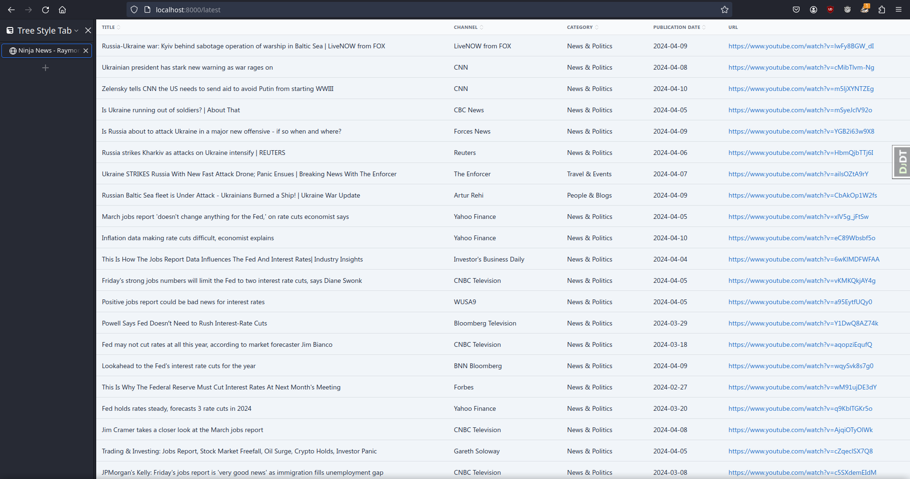
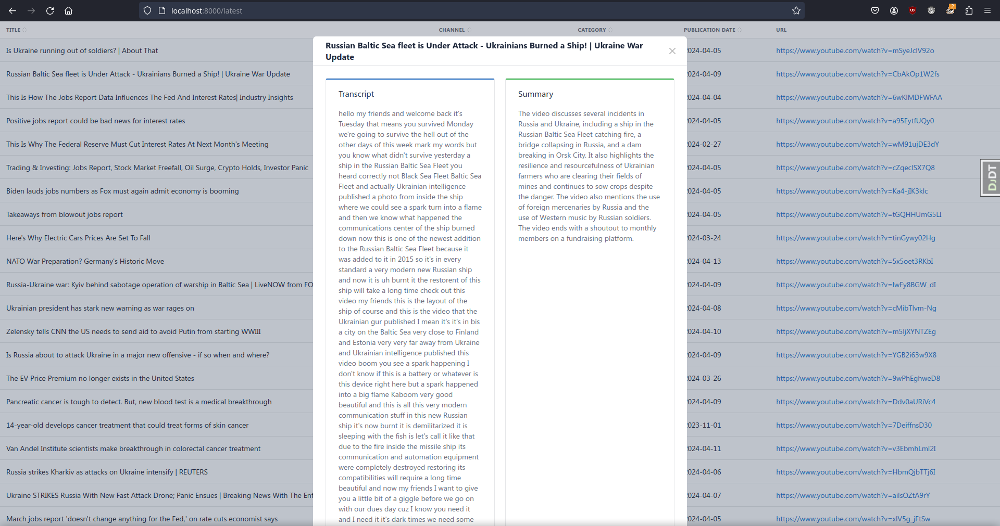
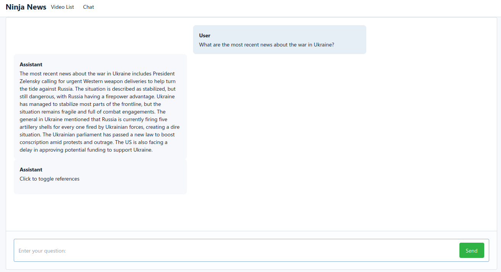
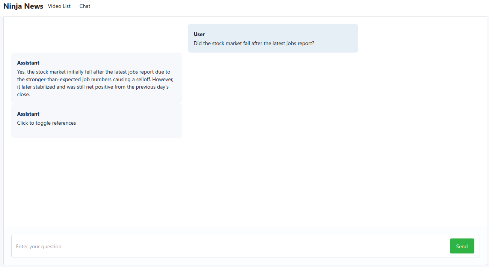
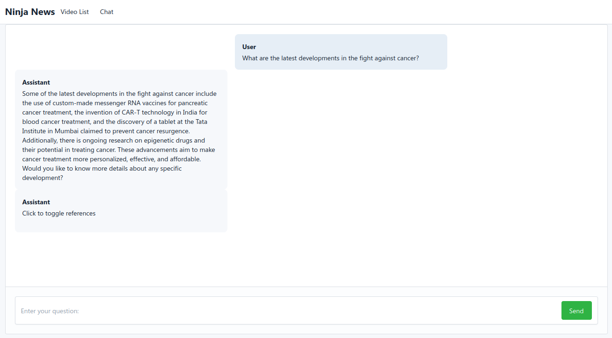
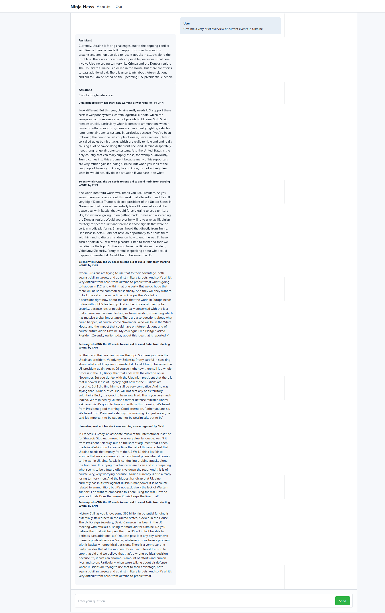

# Notes for running
1. Ensure that src/.env is created and properly sets `YOUTUBE_API_KEY` and `OPENAI_API_KEY` before bringing up the containers
2. Make sure to run the producer and consumer first thing after migrations are made and migrated
3. I recommend running the producer / consumer manually and visiting `localhost:8000/summarize` and `localhost:8000/pgvector` to avoid waiting on Celery tasks

# "News Time Machine" Project, Milestone 1
* Submitted 3/24/2024

# Milestone 2
* Submitted 4/2/2024

## Running the code
1. Build the containers with `docker-compose build`
2. Bring up the docker containers using `docker-compose up`
3. In another terminal, run `./run manage makemigrations` and `./run manage makemigrations news`
4. Run `./run manage migrate`
5. Visit the site at `localhost:8000`

## Accessing the admin view
1. With the docker container running, use `./run manage createsuperuser` to create an admin account
2. Visit `localhost:8000/admin/` to see the admin view

# Milestone 3
* Submitted 4/14/2024

## Running the Producer / Consumer
1. In src/, create a .env file that sets YOUTUBE_API_KEY to your key for the [YouTube Data API](https://developers.google.com/youtube/v3/getting-started)
* The producer and consumer for videos are scheduled to run once every half hour. To run manually use:
2. From the root directory, run `./run manage shell`
3. Run `from news.tasks import producer` or `from news.tasks import consumer`
4. Run `producer.run()` or `consumer.run()`

# Milestone 4
* Submitted 4/28/2024

## Generating Summaries
1. In src/.env, add a line setting OPENAI_API_KEY to your OpenAI API key
2. `localhost:8000/summarize` will use OpenAI to generate summaries for all videos, and return them as a dictionary. This is also run by Celery every 15 minutes.
3. `localhost:8000/latest` has been updated so that clicking a row will pull up its transcript and summary

## Populating the Vector Database
1. Visit `localhost:8000/pgvector` to populate the vector database

## Chatting
1. `localhost:8000/chat` will bring up the chat interface
2. Click the "Send" button to submit a chat. The AI is capable of accessing video transcripts as well as chat history.
3. "Click to toggle references" will show / hide the context the AI retrieved when clicked.

# Milestone 5
* Submitted 4/28/2024
## AI Responses

## Example with references shown

